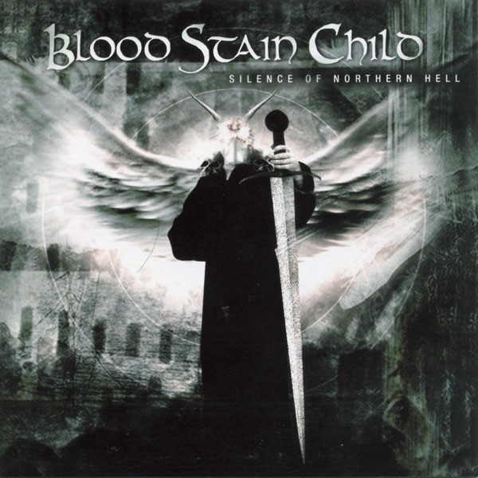

---
tags:
    - 旋律死亡金属
---
# Blood Stain Child - "Silence of Northern Hell"

## 专辑简介

"Silence of Northern Hell" 是来自日本大阪的乐队 Blood Stain Child 于2002年推出的一张旋律死亡金属专辑，在录制过程中， Ryo 演奏贝斯以及负责主唱， Ryu 演奏主音吉他， Daiki 演奏节奏吉他， Aki 负责键盘, Violator 演奏爵士鼓。整张专辑中大部分的作曲作词都是 Ryu 的杰作。 唱片在日本境内由波丽佳音公司旗下的波丽佳音厂牌发售。

 

## 曲目表

| 轨道号 | 歌曲名                        | 长度   |   
| --- | -------------------------- | ---- | 
| 01  | "Silence of Northern Hell" | 3:41 | 
| 02  | "Crimson Symphony"         | 4:45 |
| 03  | "Under the Sin of Grief"   | 5:42 |
| 04  | "Legend of Dark"           | 4:03 |
| 05  | "Requiem"                  | 4:49 |
| 06  | "King of the Sacred Sword" | 4:50 |
| 07  | "Infernal World"           | 3:25 |

## 乐评

"Silence of Northern Hell" 总的来说是一张质量不错，值得一听的专辑。 主音吉他的音色明亮圆润，具有鲜明的力量金属的风格，主音吉他与键盘 Solo 穿插在整张专辑各曲这种，使得编曲大体不至于沦落到流行歌 `过门-主歌-副歌x2-Solo-副歌` 的织体套路进行，大大提升了作品的耐听度。 Violator 的爵士鼓稳中有力，节奏安排了相当比重的 Blast Beat 以及十六分音符底鼓的铺垫， 即使在节奏吉他的音色和 riff 力道有些薄弱的情况下依旧保持了那种的凶狠而不失爽快的风格。 录音尤其是节奏吉他还是太干太涩了些，键盘和声对氛围的烘托有时会变得过于单薄。还有一个槽点比较大的地方是他们歌词的文体，呃，实在是有点一言难尽，太像是高中生写作文那味了。 以上种种让我感到乐队驾驭这种风格的程度还没有那么娴熟， 但这并不影响聆听这张专辑时的趣味。

## 单曲点评

"Under the Sin of Grief" 是我很想和大家特别聊一聊的曲子。 这不仅是因为它中二感爆棚的旋律，以及主歌第一部分管风琴音色的妙用。最让我有所感触的是它的歌词，无疑是对各位热衷于美的小可爱们身处某朝时的绝望的最佳写照，尤其下面这一节歌词

> I stand the hill of despair everyday

> That's the place of sorrow

> That's the place of grief

> Angel of salvation doesn't sweep down

> Unopened gates of Heaven

> I can only prey

真的是太典啦！

## 最后的一点吐槽

很多乐评都会把 Blood Stain Child 前两张专辑的风格与芬兰的 Children of Bodom 的早期风格进行比较， 其中不乏那种从头到脚比了个遍，然后数落 Blood Stain Child 哪点处理的没 Children of Bodom 处理的好的那种乐评，甚至还有 BSC 不过是 COB 的 “Copy Band"的指责[1]， 不知道是不是这种专辑中明亮圆润的音色和编曲在给人 “哇 COB”的第一印象之后又不能很好驾驭该风格的体验出发了一些听众的恐怖谷效应，但这种让从 COB 为立意标准出发的聆听体验感到十分不快体验的现象难道不正说明他们的这专与 COB 的早期作品是“形似神不似”的东西吗。 这张专辑质量并不水，全专七首歌并没有太多余的内容，如果不是带着对 COB 先入为主的印象来聆听这张专辑，会发现它是一张体现着被我称为"被日本文化腌入味的西洋风“的作品。
